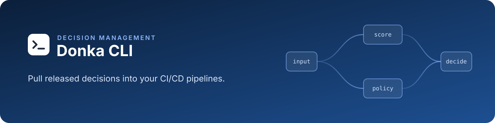

<h1 align="center">Donka CLI</h1>

<p align="center">
    Pull released decisions from Donka Studio into your CI/CD pipelines
</p>

<p align="center">
    <a href="https://github.com/youmssi/donka-cli/actions/workflows/validate.yml"></a>
    <a href="LICENSE"></a>
    <a href="https://github.com/youmssi/donka-cli/releases"></a>
    
    <a href="docs/ci-templates.md"></a>
    <a href="https://github.com/youmssi/donka"></a>
</p>

<p align="center">
    <a href="docs/pull.md">donka pull</a> ·
    <a href="docs/ci-templates.md">CI templates</a> ·
    <a href="docs/mcp.md">MCP bridge</a> ·
    <a href="CONTRIBUTING.md">Contributing</a>
</p>

## Introduction

[Donka](https://github.com/youmssi/donka) is a decision management platform for credit and risk
teams. Analysts build and approve scoring rules in Donka Studio; Donka Runtime serves them to
your systems.

The Donka CLI is the bridge to your delivery pipeline: `donka pull` asks Studio which release a
target resolves to, downloads its artifact, verifies its checksum, and leaves it ready for your
pipeline to publish wherever your Runtime reads it from.

## Features

- **Every target**: the newest release, a release by id or version, or what is live on
  `staging` or `production`
- **Checksum verified**: the download must match the SHA-256 Studio published
- **Scheduled-job friendly**: `--current` exits `3` when nothing changed, so you skip the upload
- **Sync semantics**: `--unpack` writes only what changed, atomically; `--delete` mirrors exactly
- **Ready-made CI**: a GitHub action and GitLab CI and Azure Pipelines templates, all tested
- **Safe with secrets**: the CI token travels in the environment and is never printed
- **No registry needed**: ships as a single package on each GitHub release, mirror-friendly

## Quick start

1. In Studio, open the project's **Settings → CI tokens** and create a token.
2. Run the CLI (Node.js 22 or later):

```bash
export DONKA_URL=https://donka.bank.example
export DONKA_TOKEN=dnk_ci_...                 # the CI token, read-only

VERSION=0.3.3 # x-release-please-version
npx --yes --package "https://github.com/youmssi/donka-cli/releases/download/v$VERSION/donka-cli-$VERSION.tgz" \
  donka pull --project credit-pme --target env:production --out ./dist

aws s3 cp ./dist/ s3://my-bucket/rules/live/ --recursive
```

| Target                      | Resolves to                         |
| --------------------------- | ----------------------------------- |
| `main` (default)            | the project's newest release        |
| `commit:<release id>`       | that release, by its id             |
| `release:<version>`         | that release, by version (`v1.4.0`) |
| `env:<staging\|production>` | what is live on that environment    |

| Exit code | Meaning                                       |
| --------- | --------------------------------------------- |
| `0`       | Artifact downloaded                           |
| `1`       | Error                                         |
| `2`       | Usage error                                   |
| `3`       | Nothing to do: `--current` still matches      |
| `4`       | No release yet, or nothing live on the target |

Every option, naming rule and example is in [docs/pull.md](docs/pull.md).

## CI/CD

```yaml
# GitHub Actions
- uses: youmssi/donka-cli/actions/pull@v0.3.3 # x-release-please-version
  with:
    url: https://donka.bank.example
    token: ${{ secrets.DONKA_TOKEN }}
    project: credit-pme
    target: env:production
```

GitLab CI (`extends: .donka-pull`) and Azure Pipelines (a steps template) work the same way. Inputs,
outputs and examples: [docs/ci-templates.md](docs/ci-templates.md).

## Documentation

| Page                                                                               | What it covers                                                |
| ---------------------------------------------------------------------------------- | ------------------------------------------------------------- |
| [docs/pull.md](docs/pull.md)                                                       | `donka pull`: targets, options, output naming, sync, examples |
| [docs/ci-templates.md](docs/ci-templates.md)                                       | GitHub action, GitLab CI and Azure Pipelines templates        |
| [docs/mcp.md](docs/mcp.md)                                                         | The MCP bridge for AI tools                                   |
| [rules-sync API](https://github.com/youmssi/donka/blob/develop/docs/rules-sync.md) | The Studio API the CLI speaks                                 |
| [DONKA.md](DONKA.md)                                                               | What this fork changes from upstream                          |

## Contributing

Read [AGENTS.md](AGENTS.md) and [CONTRIBUTING.md](CONTRIBUTING.md) first. Stories live in the
[Studio backlog](https://github.com/youmssi/donka/tree/develop/docs/backlog); each one gets a
`dnk-<n>-<slug>` branch, squash-merged into `develop`.

```bash
pnpm install
pnpm build        # bundle to dist/
pnpm test         # the CLI and the CI templates against a fake Studio
pnpm lint && pnpm typecheck && pnpm format
```

## License

MIT, see [LICENSE](LICENSE). Donka CLI is a fork of [gorules/cli](https://github.com/gorules/cli);
the original copyright notice is kept.
